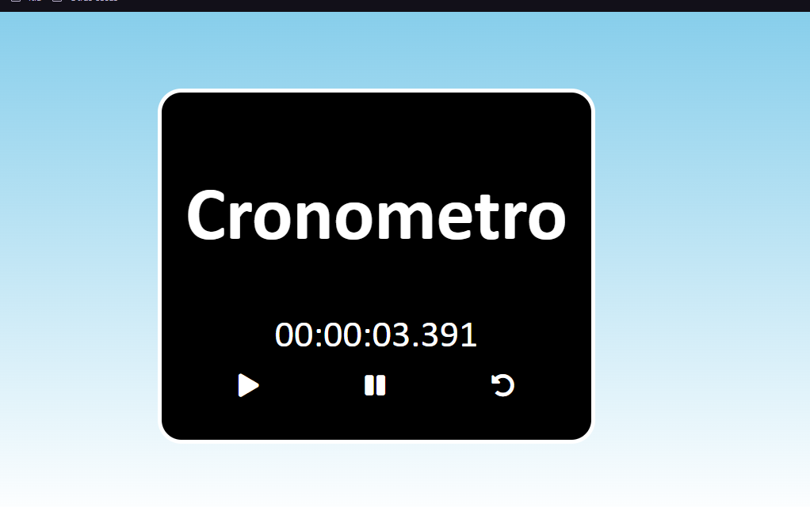

 
Un cronómetro es como un reloj especial que nos ayuda a contar el tiempo en juegos y actividades divertidas. Puedes pensar en él como un contador mágico que nos dice cuánto tiempo ha pasado desde que comenzamos algo hasta que terminamos. Por ejemplo, si estamos corriendo en el parque, podemos presionar un botón en el cronómetro cuando comenzamos a correr, y otro botón cuando terminamos. Entonces, el cronómetro nos dirá exactamente cuánto tiempo hemos corrido.

</img>